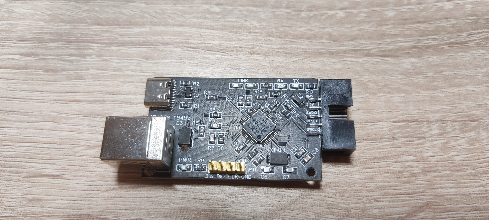
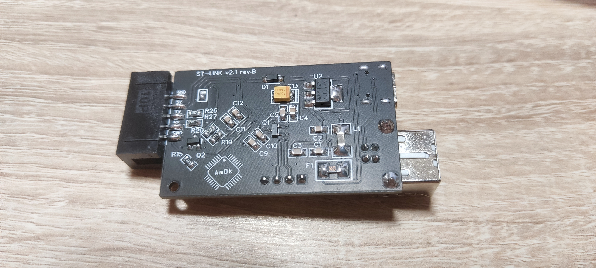
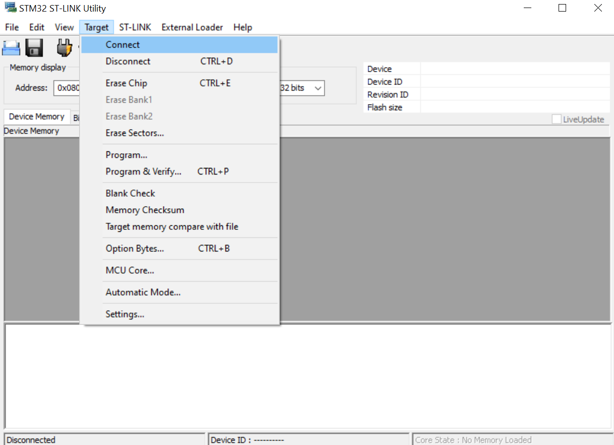
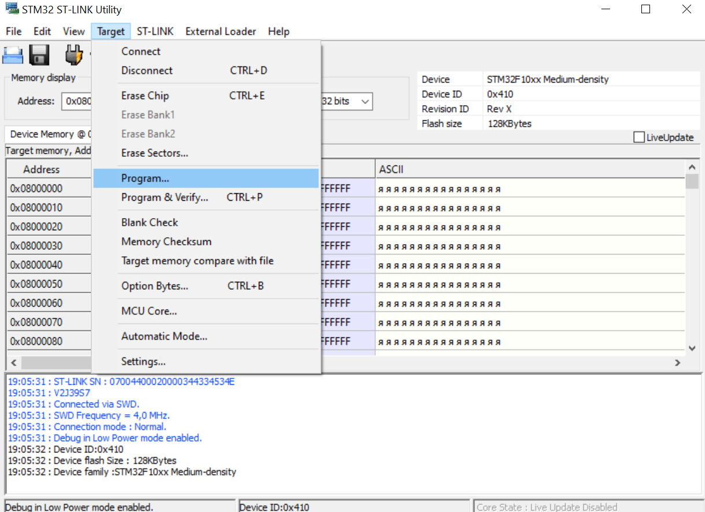
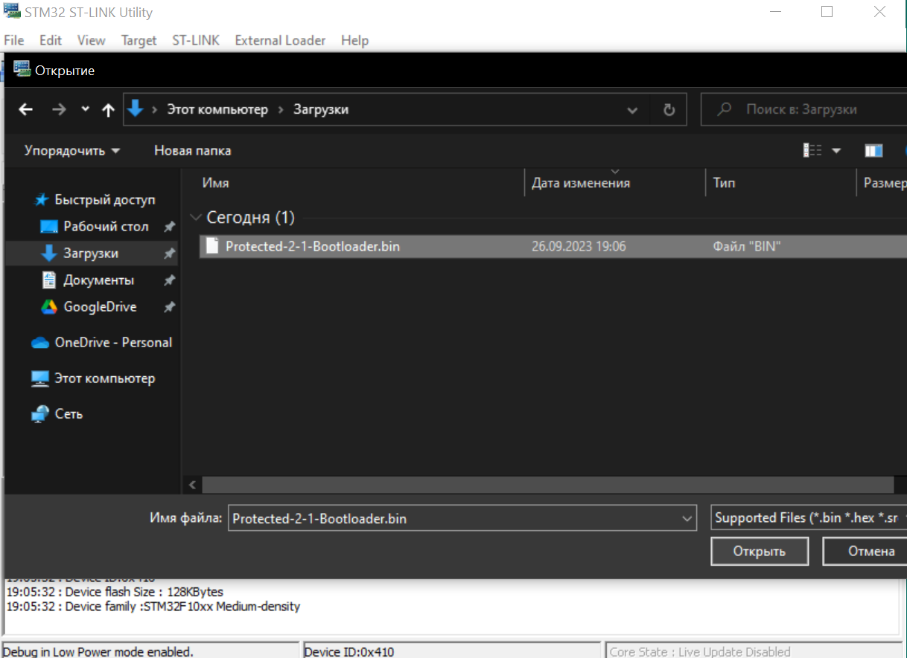
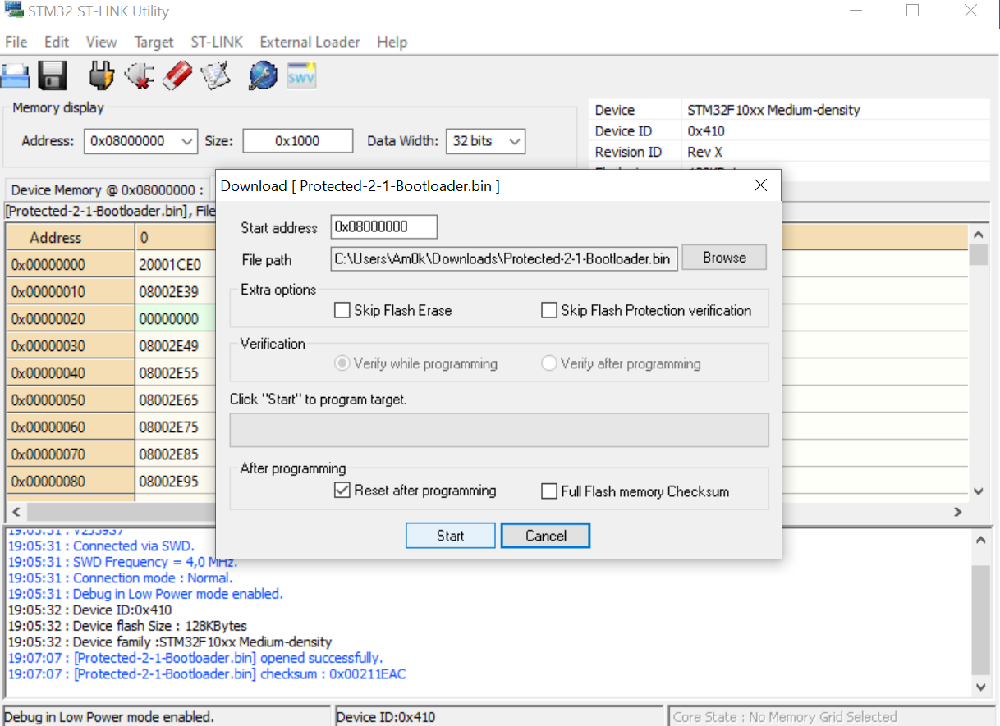
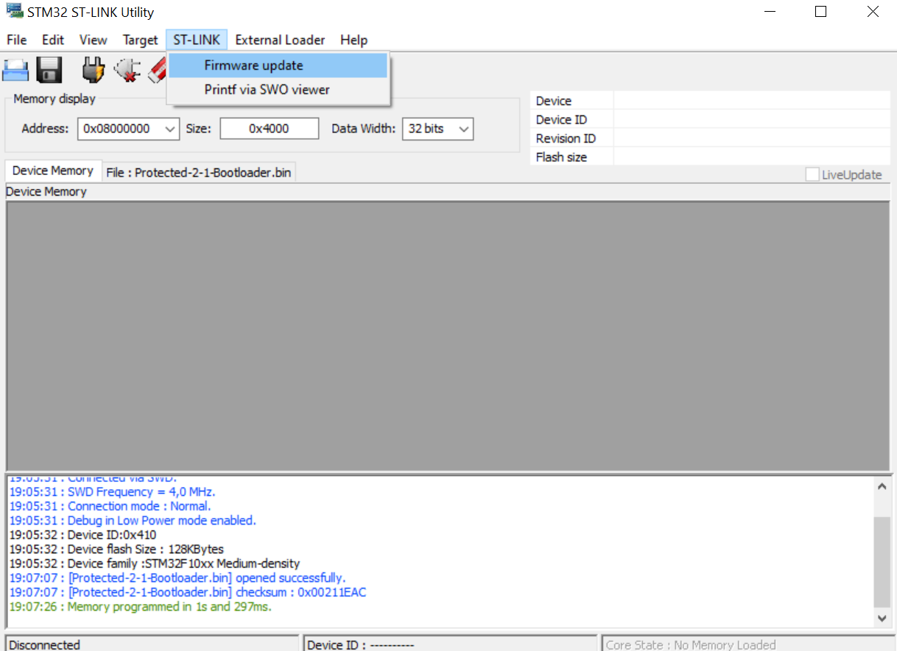
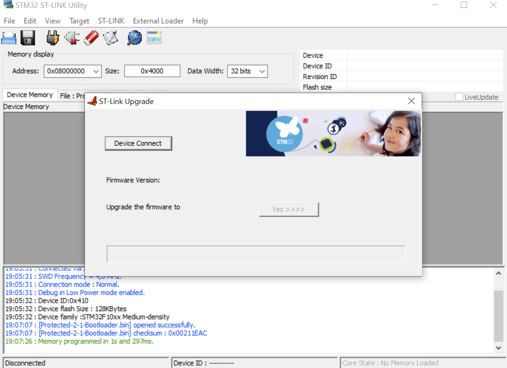
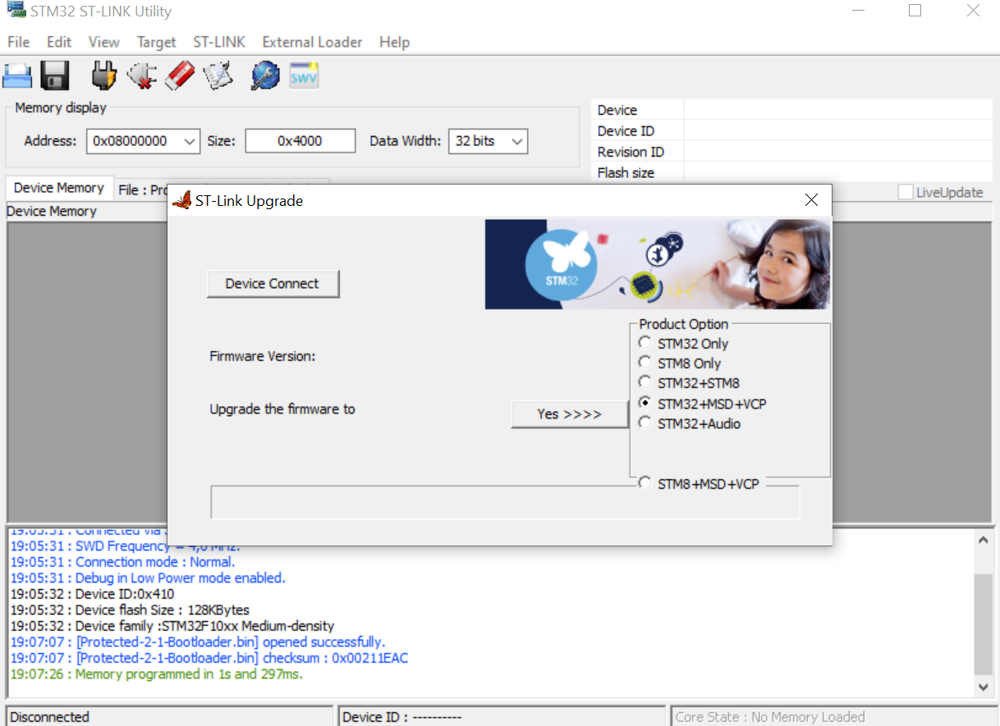
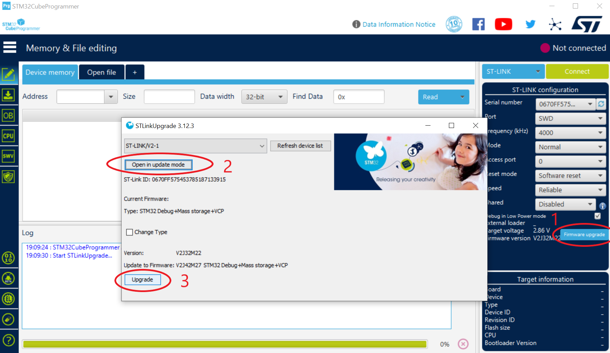

# ST-Link v2.1 rev.B

  
  

Программатор ST-Link V2-1 это внутрисхемный отладчик и программатор для микроконтроллеров серий STM32.
Программатор имеет SWD SWO RESET ( логический уровень 3.3 Вольта ) интерфейсы для работы с любым STM32 микроконтроллером, 
установленным на программируемой плате, VCP ( Virtual COM Port ) для использования UART интерфейса одновременно
с отладкой и  MSD (Mass Storage Device) для прошивки с помощью копирования файла .bin через проводник. Программатор
поддерживает автоматическое обновление встроенной прошивки для обеспечения последующей поддержки компанией ST.

`Schematic_ST-LINK_2.1_rev.B.pdf` - схема программатора

`Gerber_PCB_ST-LINK_2.1_rev.B.zip` - Gerber файл платы

`Protected-2-1-Bootloader.bin` - прошивка, содержащая загрузчик

Внимание: джампер SJ1 "PWRSELECT" распаивается в соответствии с измеряемым программатором напряжением питания - 
при замыкании верхней позиции измеряется напряжение питания МК непосредственно программатора, при замыкании нижней позиции
измеряется напряжение программируемого МК.

## Процесс установки:

 * Устанавливаем из архива программу STM32 ST-LINK Utility v4.3.0 ( с более поздними версиями работать не будет ).
	
 * Заливаем Protected-2-1-Bootloader.bin через SWD или DFU ( кому как удобнее ) на наш созданный программатор.

 

  
  
  
  

 * Подключаем только что прошитый программатор через USB и в программе ST-LINK Utility v4.3.0 выбираем -ОБНОВЛЕНИЕ.

 

  
  

 * Нам предложат несколько вариантов : нам нужен STM32 + VCP + MSD ( для STM32F103CBT6 ) выбираем его и жмем обновить. 
 В случае использования МК с 64 кБ памяти ( STM32F103C8T6 ) выбираем STM32 + Audio ( вариант без MSD ).

 

  

 * Для обновления до последней версии прошивки можно использовать 
 <a href="https://www.st.com/en/development-tools/stm32cubeprog.html">STM32 Cube Programmer</a>.

  

  

 * Для работы версии 2-1 и VCP устанавливаем драйвера которые идут в данном архиве.
	
